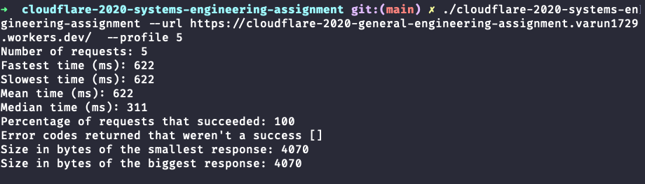
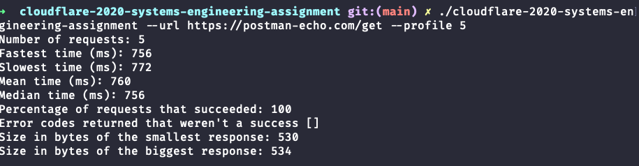
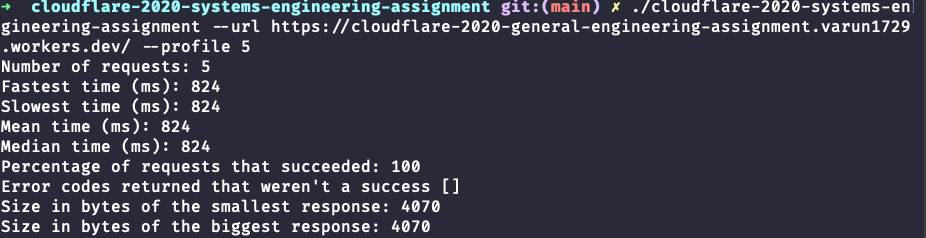
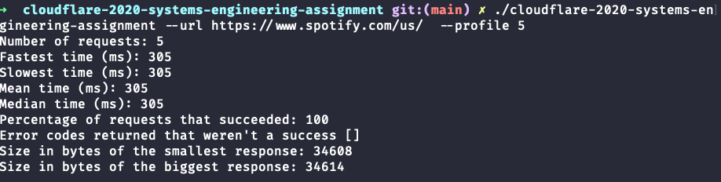

# Systems Assignment with Golang

## Build

Ensure you have `go mod`, that is go version above `1.11`.

```sh
$ go mod vendor
$ go build -mod vendor
```

This should create a binary in the directory called `cloudflare-2020-systems-engineering-assignment`. 

 ## Help Page

```txt
cloudflare-2020-systems-engineering-assignment

Usage:
  cloudflare-2020-systems-engineering-assignment --url=<URL> [--profile=<REPEAT>]
  cloudflare-2020-systems-engineering-assignment --help

Options:
  --url=<URL>        URL to visit
  --profile=<REPEAT> Number of times to REPEAT profiling
  --help             Show this screen.
```

## Notes

* Package creates a low level TLS connection. 
* TLS connection is a pipe complying to `io.writer` interface. Here `fmt.fprintf` is used to write to the file.
* Timeout of one minute.
* Output includes headers.
* Executes requests concurrently
* Does not print output for profiled request

## Output of Invoking Binary on my `/links` Page 

 ### Command

```bash
$ ./cloudflare-2020-systems-engineering-assignment --url https://cloudflare-2020-general-engineering-assignment.varun1729.workers.dev/links
```

### Output

```txt
HTTP/1.1 200 OK
Date: Sun, 18 Oct 2020 10:21:08 GMT
Content-Type: application/json
Content-Length: 152
Connection: close
Set-Cookie: __cfduid=df05cf9f8412a2cd7618d36922be3c4241603016468; expires=Tue, 17-Nov-20 10:21:08 GMT; path=/; domain=.varun1729.workers.dev; HttpOnly; SameSite=Lax
cf-request-id: 05dcd34085000004b81a145000000001
Expect-CT: max-age=604800, report-uri="https://report-uri.cloudflare.com/cdn-cgi/beacon/expect-ct"
Report-To: {"endpoints":[{"url":"https:\/\/a.nel.cloudflare.com\/report?lkg-colo=12&lkg-time=1603016469"}],"group":"cf-nel","max_age":604800}
NEL: {"report_to":"cf-nel","max_age":604800}
Server: cloudflare
CF-RAY: 5e4187e0dc0304b8-LAX

[{"name":"CloudFlare","url":"https://www.cloudflare.com"},{"name":"Reddit","url":"https://www.reddit.com"},{"name":"GitHub","url":"https://github.com"}]
```

## `--profile` Output

### https://cloudflare-2020-general-engineering-assignment.varun1729.workers.dev/



###https://postman-echo.com/get



### https://www.amazon.com/



### https://www.spotify.com/us/



My cloudFlare site is most consistant than the other sites. My site's performance seems to be on par with other sites. 

